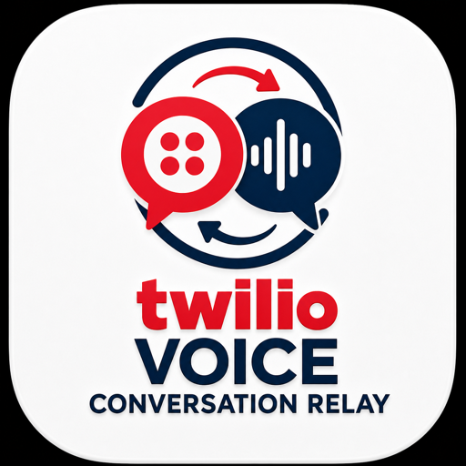
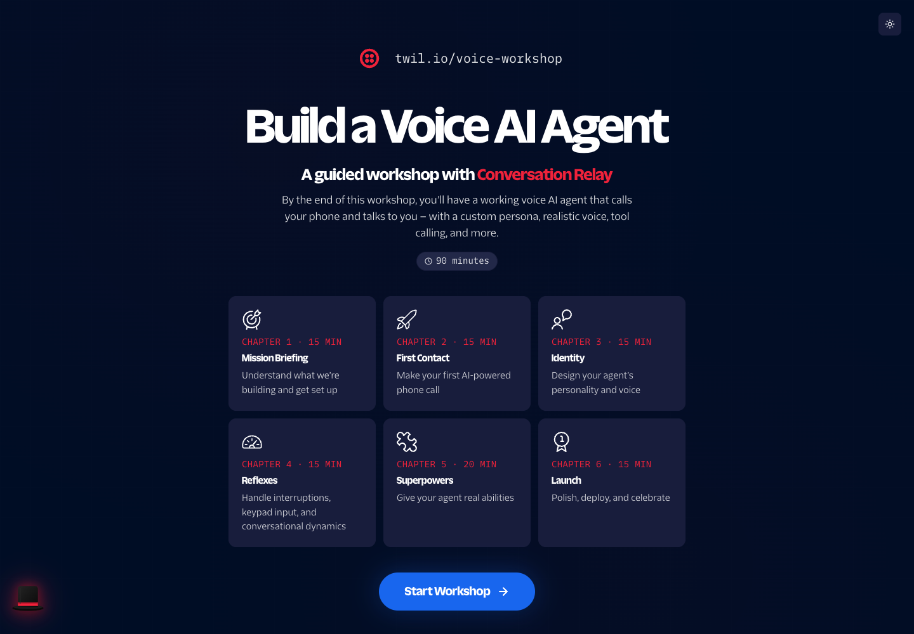
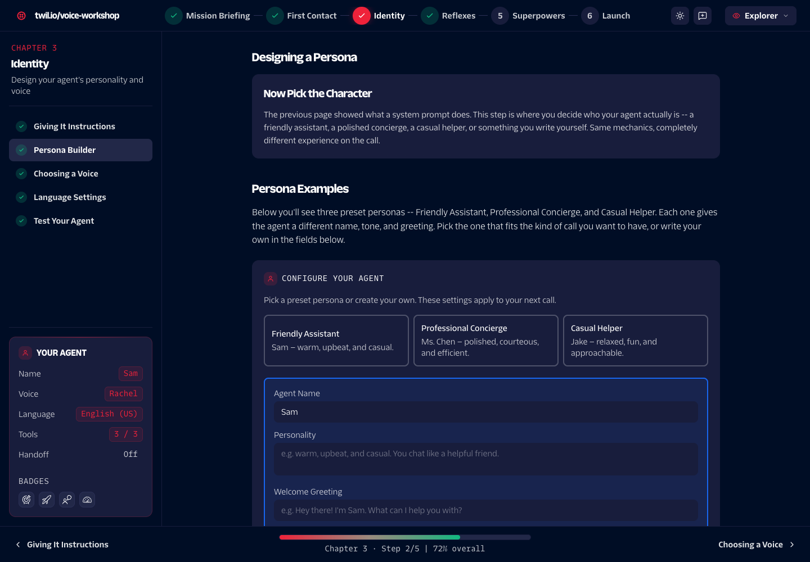
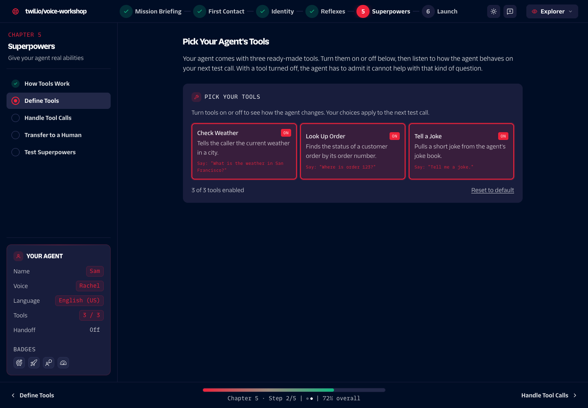
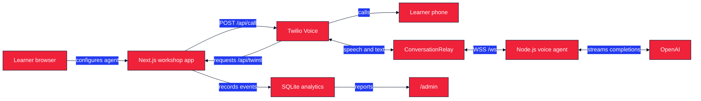

<p align="center">
  
</p>

<h1 align="center">Build a Voice AI Agent</h1>

<p align="center">
  A guided workshop for building a conversational phone agent with Twilio ConversationRelay, OpenAI, and Node.js.
</p>

<p align="center">
  <a href="https://github.com/agithony/twilio-voice-ai/actions/workflows/ci.yml"></a>
  
  
  
</p>

<p align="center">
  <a href="#overview">Overview</a> &middot;
  <a href="#for-workshop-attendees">Attendees</a> &middot;
  <a href="#installation">Installation</a> &middot;
  <a href="#inside-the-workshop">Screenshots</a> &middot;
  <a href="#architecture">Architecture</a> &middot;
  <a href="#deployment">Deployment</a>
</p>

## Inside the Workshop

<table>
  <tr>
    <td colspan="2">
      
      <br />
      <strong>Workshop map</strong>
      <br />
      Start from a six-chapter overview that shows the learning path, outcomes, and estimated time for each stage.
    </td>
  </tr>
  <tr>
    <td width="50%">
      
      <br />
      <strong>Build an agent identity</strong>
      <br />
      Choose a preset persona or configure the agent's name, personality, greeting, voice, and language.
    </td>
    <td width="50%">
      
      <br />
      <strong>Add real capabilities</strong>
      <br />
      Toggle tools for weather, order lookup, and jokes, then test how those choices change the next call.
    </td>
  </tr>
</table>

## Overview

This repository contains the workshop experience, its six chapters of content, and a built-in voice agent runtime. Learners can follow a visual Explorer track or build the Node.js agent step by step in the Builder track.

The completed agent can place an outbound call, stream OpenAI responses through ConversationRelay, switch voices and languages, respond to keypad input, run demo tools, detect silence, and hand a call off to a human.

### Learning modes

| Mode | Intended for | Experience |
|---|---|---|
| **Explorer** | Learners who want the concepts without writing code | Visual summaries, interactive configuration, and a built-in agent |
| **Builder** | Developers building the agent | Codespaces, guided implementation, code examples, and optional solutions |

Learners choose a mode on their first visit and can switch modes from the workshop header at any time.

## For Workshop Attendees

### Prerequisites

- A GitHub account with access to [Codespaces](https://github.com/features/codespaces) for the Builder track
- A phone that can receive the workshop's test call
- Approximately 90 to 95 minutes
- Twilio and OpenAI credentials from the facilitator, or your own accounts

Facilitated events may provide shared credentials. The Codespace only prefills credentials that have been configured as repository Codespaces secrets; fill any blank values in `workshop/.env` before making a call.

### Getting started

1. Open the workshop URL provided by the facilitator.
2. Choose **Explorer** or **Builder** when prompted.
3. For Builder mode, select **Code** > **Codespaces** > **Create codespace on main** in this repository.
4. Add your personal phone number to `MY_PHONE_NUMBER` in `workshop/.env` using [E.164 format](https://www.twilio.com/docs/glossary/what-e164), such as `+15551234567`.
5. Follow the chapter navigation in the workshop app.

The dev container installs the Builder dependencies, starts a Cloudflare Quick Tunnel for port `8080`, and writes available workshop secrets to `workshop/.env`.

### Workshop agenda

| # | Chapter | Outcome | Estimate |
|---:|---|---|---:|
| 1 | **Mission Briefing** | Understand the architecture and prepare the environment | 15 min |
| 2 | **First Contact** | Build the WebSocket server and make the first call | 15 min |
| 3 | **Identity** | Configure the agent's persona, voice, and language | 15 min |
| 4 | **Reflexes** | Handle interruptions, keypad input, silence, and language switching | 15 min |
| 5 | **Superpowers** | Add demo tools and live agent handoff | 20 min |
| 6 | **Launch** | Polish, deploy, and present the agent | 15 min |

Chapter estimates are pacing guides and currently total 95 minutes.

## Installation

These steps run the full companion app and its custom WebSocket server locally.

### Maintainer prerequisites

- [Node.js 20](https://nodejs.org/)
- [pnpm 10.20](https://pnpm.io/installation)
- A Twilio account SID, auth token, and voice-capable phone number for test calls
- An OpenAI API key for agent responses

### Local setup

```bash
git clone https://github.com/agithony/twilio-voice-ai.git
cd twilio-voice-ai
pnpm install
cp .env.example .env.local
pnpm dev
```

Open [http://localhost:8080](http://localhost:8080). Edit `.env.local` before testing calls. Twilio also needs a public HTTPS and secure WebSocket URL to reach a local voice server; use the workshop Codespace tunnel or another development tunnel for end-to-end call testing.

## Usage

| Command | Purpose |
|---|---|
| `pnpm dev` | Run Next.js, the voice WebSocket endpoint, and analytics on port `8080` |
| `pnpm dev:next` | Run only the Next.js development server; voice WebSockets and analytics are unavailable |
| `pnpm lint` | Run ESLint |
| `pnpm typecheck` | Run TypeScript without emitting files |
| `pnpm build` | Create the production Next.js build |
| `pnpm start` | Start the custom server using the current `NODE_ENV` |

The home page launches the workshop. Presenter slides are available at `/slides`, health status at `/health`, and workshop analytics at `/admin`.

> [!WARNING]
> The `/admin` dashboard and destructive `/admin/reset-all` endpoint do not implement application-level authentication. Protect these routes with an upstream access policy before exposing them outside a controlled workshop environment. Analytics use local SQLite storage and reset when the container is replaced.

## Configuration

Copy `.env.example` to `.env.local` for the companion app.

| Variable | Required | Purpose |
|---|---:|---|
| `TWILIO_ACCOUNT_SID` | For calls | Twilio account identifier |
| `TWILIO_AUTH_TOKEN` | For calls | Twilio API credential |
| `TWILIO_PHONE_NUMBER` | For calls | Voice-capable Twilio number in E.164 format |
| `OPENAI_API_KEY` | For calls | OpenAI credential used by the built-in agent |
| `OPENAI_MODEL` | No | Chat Completions model; defaults to `gpt-5.4-nano` |
| `HANDOFF_PHONE_NUMBER` | For handoff | Human destination number in E.164 format |
| `WORKSHOP_SLIDES_EMBED_URL` | No | Published Google Slides embed URL for `/slides` |
| `PORT` | No | Custom server port; defaults to `8080` |

The attendee-built scaffold under `workshop/` uses its own `.env` and additionally requires `MY_PHONE_NUMBER`.

## Architecture

The root app uses a custom Node.js HTTP server so Next.js routes, ConversationRelay WebSockets, and analytics share one port.



### Repository map

| Path | Responsibility |
|---|---|
| `src/app/` | Next.js pages and API routes |
| `src/content/` | Six chapters and 29 registered workshop steps |
| `src/workshop.config.ts` | Workshop metadata, branding, features, and sharing |
| `voice-agent/` | Built-in ConversationRelay and OpenAI runtime |
| `analytics/` | Event storage, dashboard queries, and PDF reports |
| `workshop/` | Starter project that Builder attendees complete |
| `.devcontainer/` | Codespaces setup and Cloudflare tunnel startup |

### Runtime endpoints

| Endpoint | Purpose |
|---|---|
| `POST /api/call` | Initiate an outbound Twilio call |
| `POST /api/twiml` | Return ConversationRelay TwiML |
| `WS(S) /ws` | Exchange ConversationRelay messages with the built-in agent |
| `POST /api/events` | Ingest workshop analytics events |
| `GET /health` | Return liveness and uptime |
| `GET /admin` | Render the analytics dashboard |

## Customization

- Edit `src/workshop.config.ts` to change workshop metadata, chapter navigation, branding, themes, feature toggles, and share copy.
- Add typed content blocks under `src/content/` and register each step in `src/content/registry.ts`.
- Read the [workshop authoring guide](./WORKSHOP_AUTHORING.md) for content examples and platform conventions.
- Put app-served illustrations and icons under `public/images/`. Put README-only artwork under `docs/assets/`.

The content system is reusable, while the included API routes, voice agent, and analytics remain specific to this Voice AI workshop.

## Deployment

Pushes to `main` run lint, type checking, a production build, and secret scanning. Pull requests also run dependency review. A successful `Validate` job builds a Docker image, pushes it to Azure Container Registry, and deploys it to Azure Container Apps with OpenID Connect (OIDC) authentication.

- [Deployment workflow and rollback](./docs/DEPLOYMENT.md)
- [One-time Azure infrastructure setup](./docs/INFRA_SETUP.md)

## Key Technologies

| Technology | Role |
|---|---|
| [Twilio ConversationRelay](https://www.twilio.com/docs/voice/conversationrelay) | Connects a phone call to the application over WebSockets and handles speech-to-text and text-to-speech |
| [Twilio Voice TwiML](https://www.twilio.com/docs/voice/twiml) | Defines call behavior and ConversationRelay configuration |
| [OpenAI Chat Completions](https://platform.openai.com/docs/api-reference/chat) | Streams model output and tool calls |
| [Next.js](https://nextjs.org/) | Renders the workshop UI and API routes |
| [GitHub Codespaces](https://github.com/features/codespaces) | Provides the Builder development environment |
| [Cloudflare Quick Tunnels](https://developers.cloudflare.com/cloudflare-one/connections/connect-networks/do-more-with-tunnels/trycloudflare/) | Gives the attendee server a temporary public endpoint |
| [Azure Container Apps](https://learn.microsoft.com/azure/container-apps/) | Hosts the production container |

## License

No license has been declared for this repository. Source availability does not grant permission to copy, modify, or redistribute the project.
